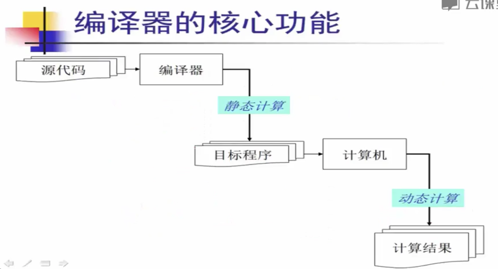
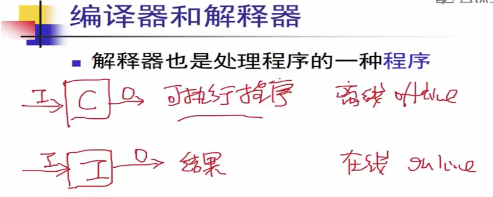
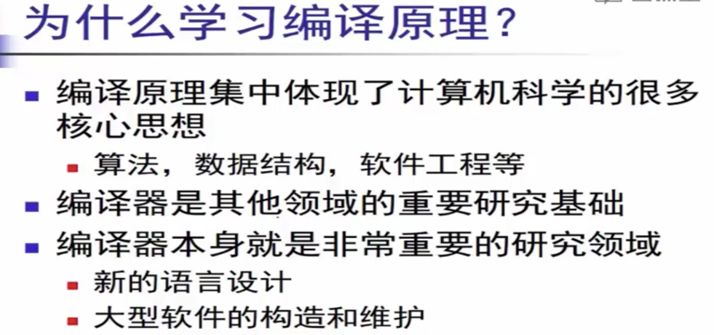

# 编译器和解释器简介

## 编译器

**编译器是一个程序,   核心功能是把`源代码`翻译成`目标代码`.  生成一个可执行程序\(或者其他源代码\)**

### 编译器设计 最基本的要求

**所生成的目标程序,要和源代码语意相同**. \(源代码完成什么功能,目标程序要就完成什么功能\).

## 解释器

**解释器也是处理程序的一种`程序`** .

#### 解释器会直接打印或输出结果,不会生成可执行程序.

## 编译器和解释器

## 为什么学习编译原理

