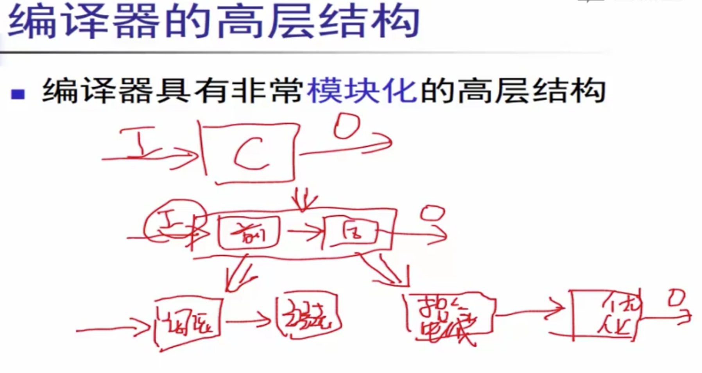
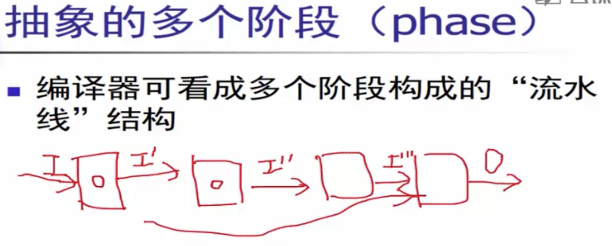
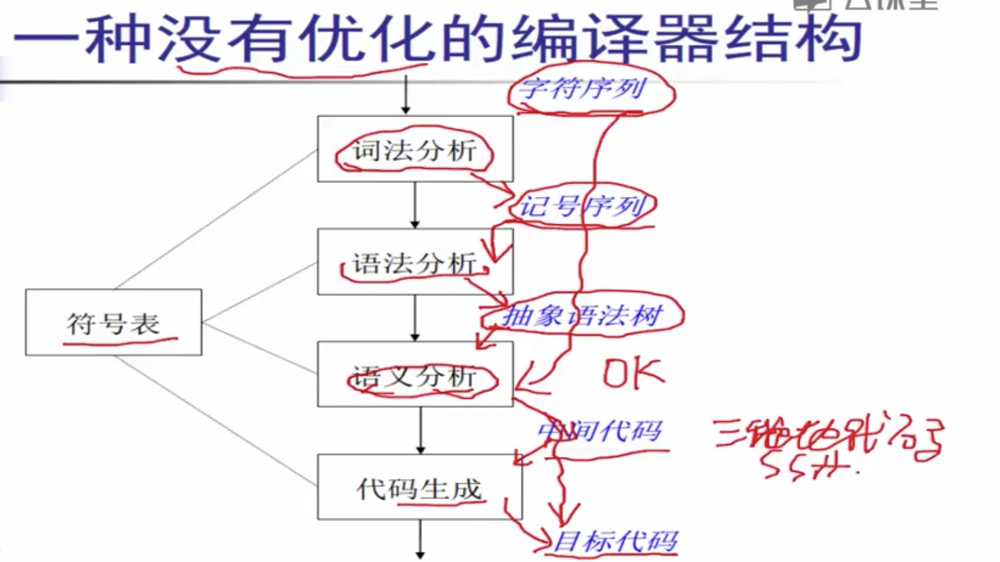
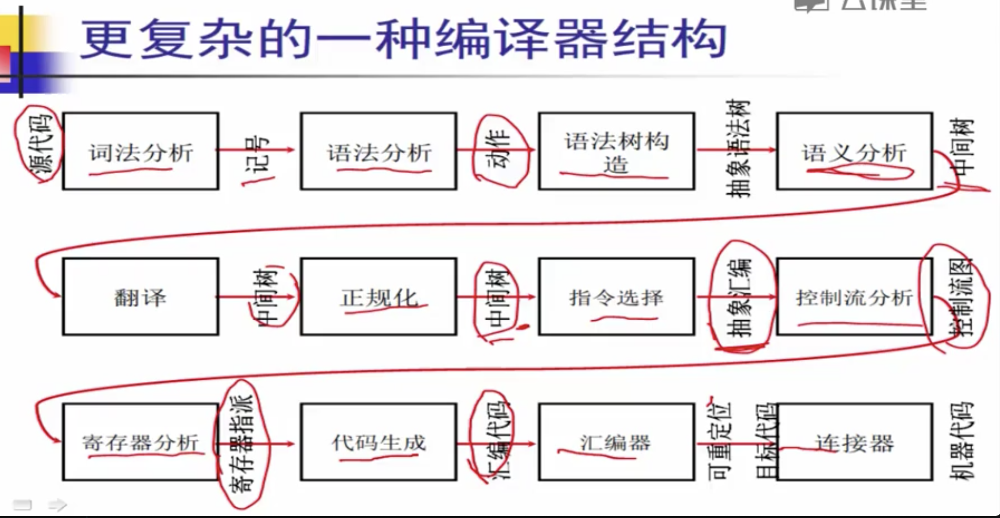

# 编译器结构

## 编译器的高层结构

## 抽象的多个阶段

## 编译器结构

### 一种简单的编译器结构

### 一种复杂的编译器结构

### 小结

* **编译器由多个阶段组成, 每个阶段都要处理不同的问题.**
  * **使用不同的理论, 数据结构和算法**
* **因此, 编译器设计重的重要问题是如何合理划分组织各个阶段**
  * **接口清晰**
  * **编译器容易实现,维护**
* **编译器的结构和具体的编译目标有关.**

