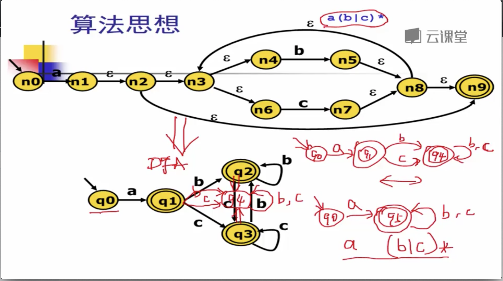

# 词法分析

## 编译器的阶段和词法分析任务

### 编译器的阶段

#### 源程序  ----&gt;  编译器  ----&gt; target program \(目标程序\)

#### 源程序 ---&gt;  front end\(前端\) ---&gt;  IR\(中间表示\)  ---&gt; back end\(后端\)  ---&gt; target program\(目标程序\)

### 

### 前端

**前端包含: 词法分析器, 语法分析器,  语义分析器**

#### 

### 词法分析器的任务

#### 

#### 一个词法分析的例子

### 词法分析器的任务:  字符流到记号流

* **字符流**
  * 和被编译的语言密切相关 \( ASCII , UNICODE, or ....\)
* **记号流**
  * 编译器内部定义的数据结构, 编码所标记 识别出的词法单元

## 词法分析的实现方法

* **至少有两种实现方法:**
  * _手工编码实现法_
    * `相对复杂, 且容易出错`
    * `但是目前非常流行的实现方法`
      * _`GCC , LLVM .....`_
  * _词法分析器的生成器  \(这是个工具\)_
    * `可快速原型, 代码较少`
    * `但较难控制细节`

## 手工编码实现法

#### 转移图是理解手工编码实现的核心.

转移图中 `4号` 上面的 \*  代表回滚, 将 `1号` 读取过来的字符放回到原有的字符流中,然后识别为`小于号`.

### 第一类识别关键字的算法

### 第二类识别关键字的算法

## 词法分析器的生成器

#### 这个就是依靠工具来实现, 程序员只需要填充少量代码就可以进行自动生成.

**词法分析器的生成需要 正则表达式**

* **有两种实现方式方式**
  * 手工实现算法
  * 自动生成法
    * 用到: 正则表达式,  语法糖,  有限状态自动机,  

### 正则表达式 \( RE \)

### 

### 标识符

### 

### 语法糖

### 

### 有限状态自动机   \(FA, DFA, NFA\)

#### 确定有限状态自动机 DFA

#### 非确定有限状态自动机  NFA

**有限状态自动机DFA 比 非确定有限状态自动机NFA 更加容易进行判断, 一般情况下需要将 NFA 转换成 DFA 来进行判断** 

### 有限自动状态机小结

### 有限状态自动机 DFA 的实现

### ER 转换到 NFA \(正则表达式到非确定有限状态自动机的转换算法\)

 **正则表达式ER ---&gt;  NFA  ---&gt;  DFA  ---&gt;  词法分析器代码**

#### RE --&gt; NFA 过程的算法  Thompson算法

#### 结合性顺序: 括号的优先级最高, 然后是闭包 , 随后是链接

### 

### NFA 转换到  DFA   \(非确定转换到确定  有限自动机 算法\)

### DFA 最小化算法 \(作用于 DFA,相当于压缩\)

### 

### DFA 生成分析算法 \(代码表示\)

**DFA代码表示, 将前面得到的状态积转变成一个最终能够实际运行的代码,从而制造一个词法分析器**

#### DFA 的代码表示

* 概念上讲, DFA是一个有向图
* 实际上, 有不同的 DFA 的代码表示
  * **转移表 \(类似于邻接矩阵\)**
  * **哈希表**
  * **跳转表**  _**&lt;效率比转移表高一些,内存占用相对少一些&gt;**_
  * ......等等 各种形式
* 取决于在实际实现中, 对时间空间的权衡

_**转移表**_

_\*\*\*\*_

_**跳转表**_

