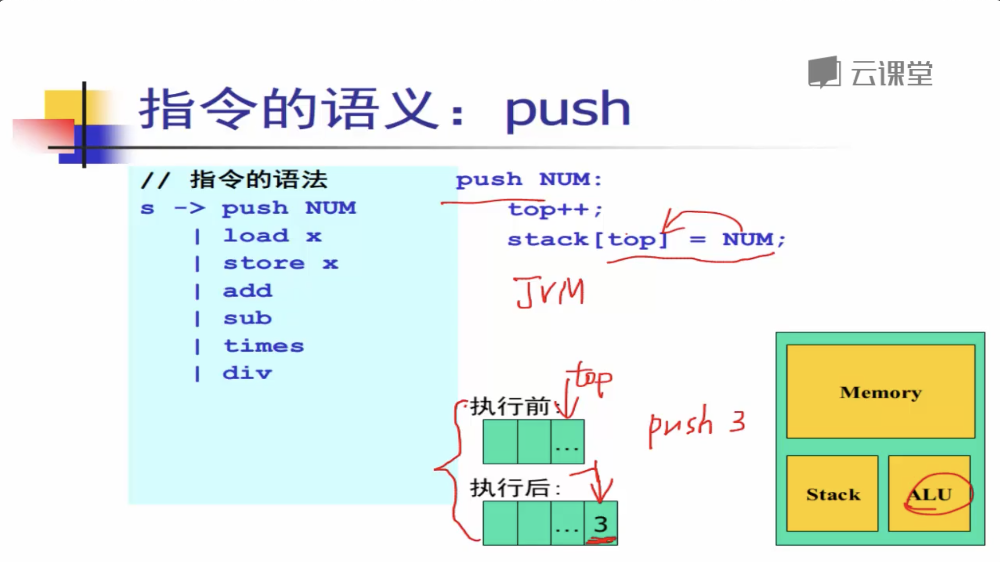
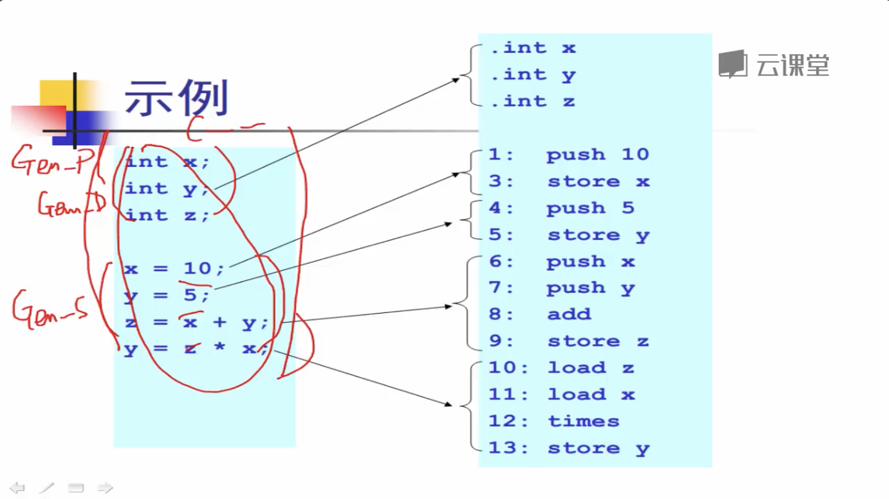
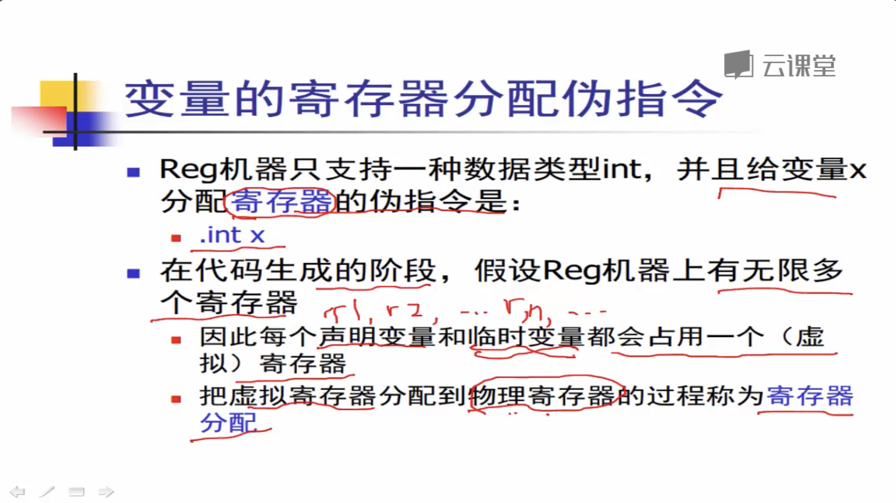
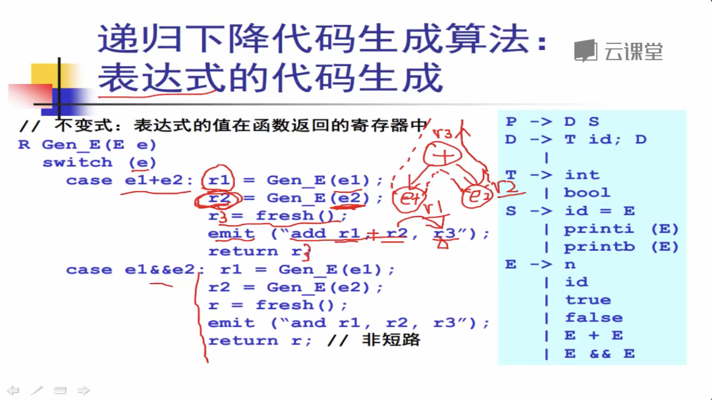

# 代码生成

## 代码生成

### 代码生成的任务

#### 给数据分配计算资源

#### 给源程序的代码选择合适的机器指令

### 路线图

## 栈式计算机 代码生成技术

### ALU 能够执行的指令

push NUM     将一个立即数压入栈顶, 栈的大小 增加一

load x  把一个变量x ,从内存当中 读入到栈顶上, 栈的大小 增加一

store x    把栈顶元素弹出去, 并且把它赋值给内存当中 x 这个变量,  栈的大小 减少一

### 指令的语义 : push

### 指令的语义:  load  x

### 指令的语义:  store  x

### 指令的语义:  add , sub, times, div

###  变量内存分配的伪指令

### 递归下降生成算法

#### 表达式的代码生成

#### 语句的代码生成

#### 类型代码的生成   \(目前只有两个类型, 一个是int , 一个是bool, 但都是数值类型\)

#### 程序的代码生成

#### 应用如上代码的示例

### 运行生成的代码

## 寄存器计算机 及其代码生成

### 寄存器计算机的指令集

![&#x65B9;&#x62EC;&#x53F7;\[\] &#x5185;&#x4EE3;&#x8868;&#x7684;&#x662F; &#x5185;&#x5B58; ](.gitbook/assets/ping-mu-kuai-zhao-2019061519.34.38.png)

* movn  n , r        
  * **将寄存器n 的 `整形值` ,赋值给 寄存器r**
* mov    r1, r2
  * **将寄存器r1 的值 , 赋值给 r2**
* load    \[x\]    r
  * 将**内存 x 位置的值, 赋值给 寄存器 r**
* store   r  \[x\]  
  * **将 寄存器r 的值, 赋值给内存 x 位置**
* add  r1,  r2   ,r3 
  * **将 寄存器r1 和 寄存器r2 的值`相加,`  然后将结果放入到寄存器 r3 里面**
* sub  r1 , r2 ,  r3
  * **将寄存器 r1的值  `减去` 寄存器 r2 的值, 然后将结果放入到寄存器 r3  里面**
* times  r1 , r2 , r3
  * **将寄存器 r1 的值  `乘上`  寄存器r2 的值,  然后将结果存入到寄存器 r3 里面**
* div   r1,  r2  ,r3
  * **将寄存器 r1 的值  `除以` 寄存器r2 的值,   然后将结果存入到寄存器r3 里面**

### 变量的寄存器分配伪指令

### 递归下降代码生成算法

### 表达式的代码生成

### 语句的代码生成

### 类型的代码生成

### 变量声明的代码生成

### 程序的代码生成

### 生成范例

### 运行生成的代码

**运行的核心是 将`无限`多个寄存器抽象成 `单链表`,   或者 让`两个虚拟的寄存器` `共享` `同一个 物理寄存器`      但是要控制好什么时候可以共享, 什么时候不可以共享.**

