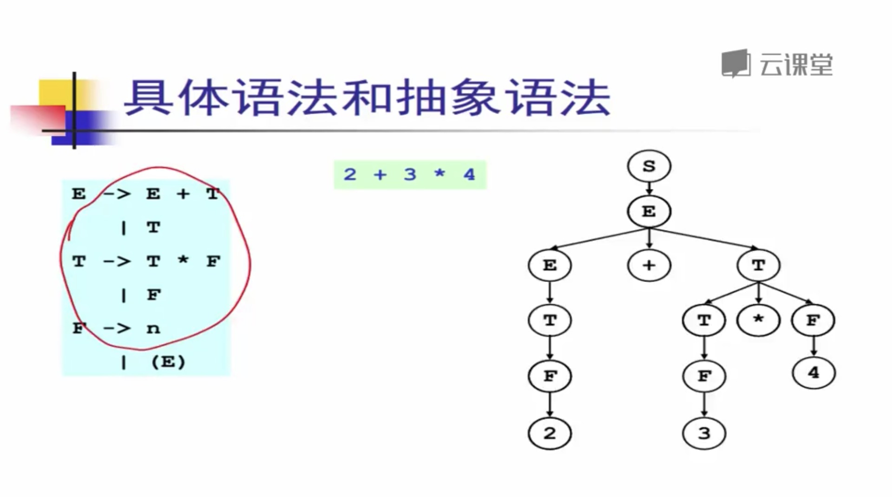

# 分析树 和 抽象语法树

## 分析树

**`分析树`是`抽象语法树的前身`,  因为`分析树过大会占用很多内存空间`, 抽象成`语法树`后,`空间占用大大减少`.**

## 抽象语法树

**`抽象语法树`是 `分析树`** **的一个浓缩**

### \*\*\*\*

### **具体语法 和 抽象语法**

* **`具体语法`是`语法分析器`使用的语法**
  * **必须适用于`语法分析`,  如`各种分隔符, 消除左递归, 提取左公因子 , 等等`**
* **`抽象语法` 是用来表达语法结构的内部表示.**
  * **现代编译器一般都采用 `抽象语法`作为`前端(词法 语法 分析) 和 后端(代码生成) 的接口`**

#### **具体语法**

#### 抽象语法

### **抽象语法树 和 数据结构**

**因为涉及到 `数据结构`,  所以 `一定需要某一种语言来进行编写.`**

* **在编译器中, 为了定义`抽象语法树` , 需要使用 `实现语言(编写编译器的语言)` 来定义`一组数据结构.`**
  * **和实现语言密切相关**
* **`早期`的编译器有的`不采用抽象语法树` 数据结构**
  * **`直接在语法制导翻译中生成代码 (早期电脑的内存硬件限制)`**
  * **但现代的编译器一般都采用抽象语法树作为语法分析器的输出**
    * **更好的系统支持,**
    * **简化编译器的设计**
    * **编译器更加的模块化, 更加的利于维护**

## 抽象语法树的定义 \(C语言版\)

## 抽象语法树的自动生成

\*\*\*\*

\*\*\*\*

\*\*\*\*

\*\*\*\*

\*\*\*\*

\*\*\*\*

\*\*\*\*

