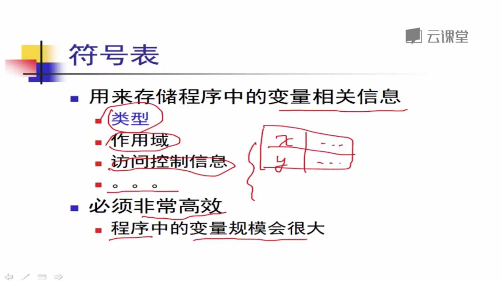
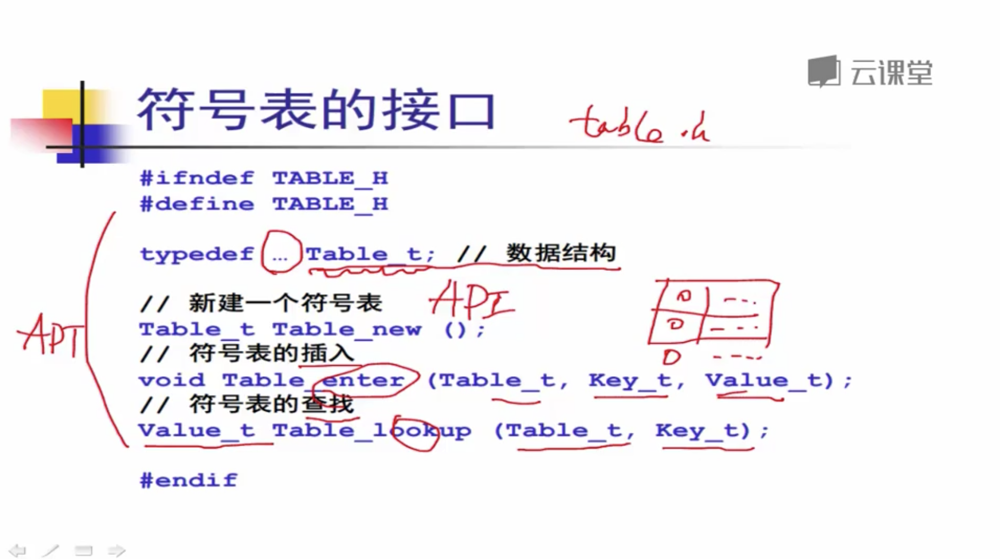
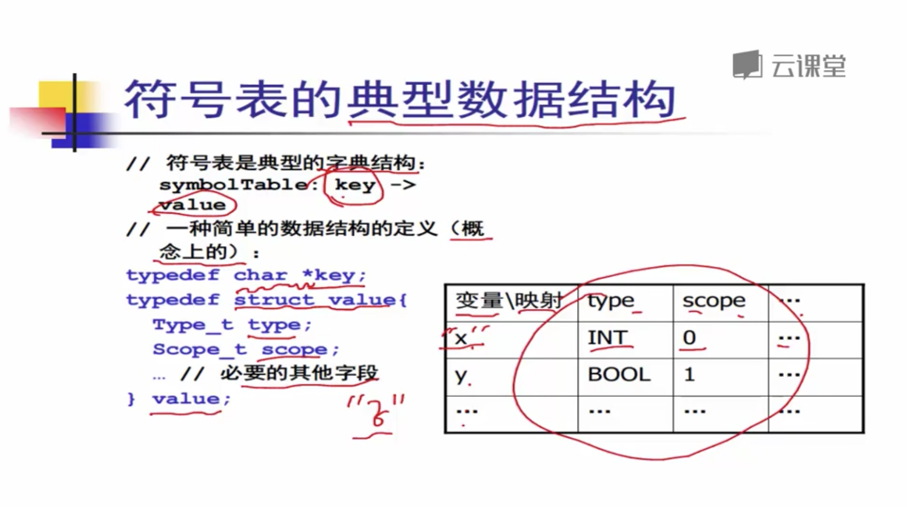
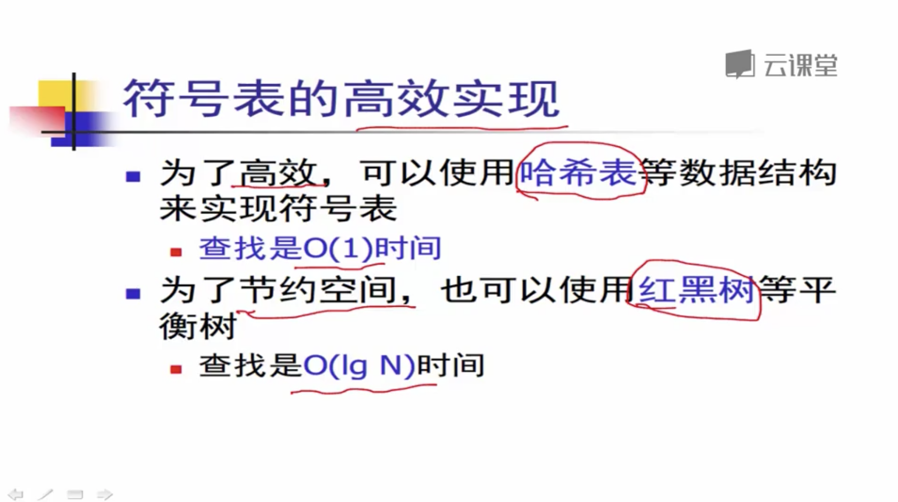
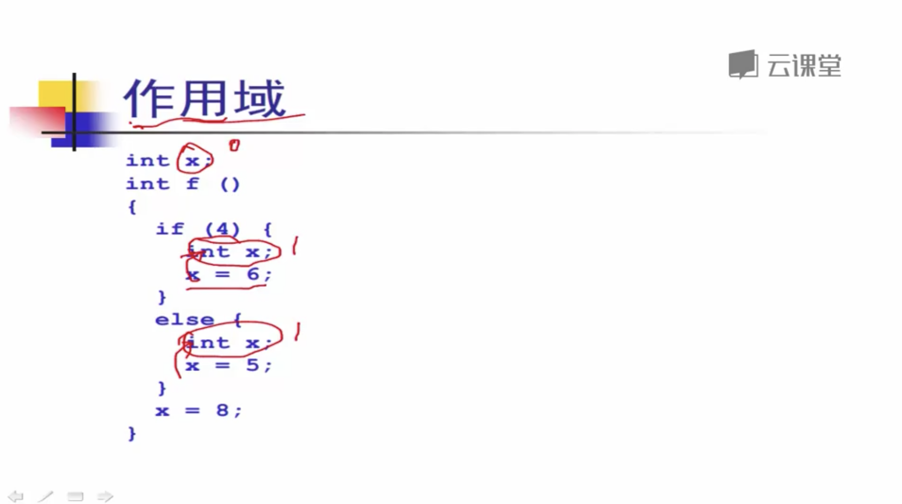
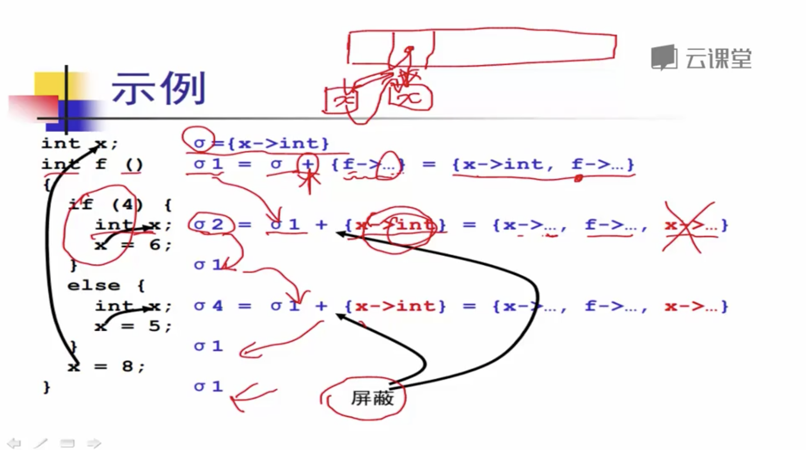
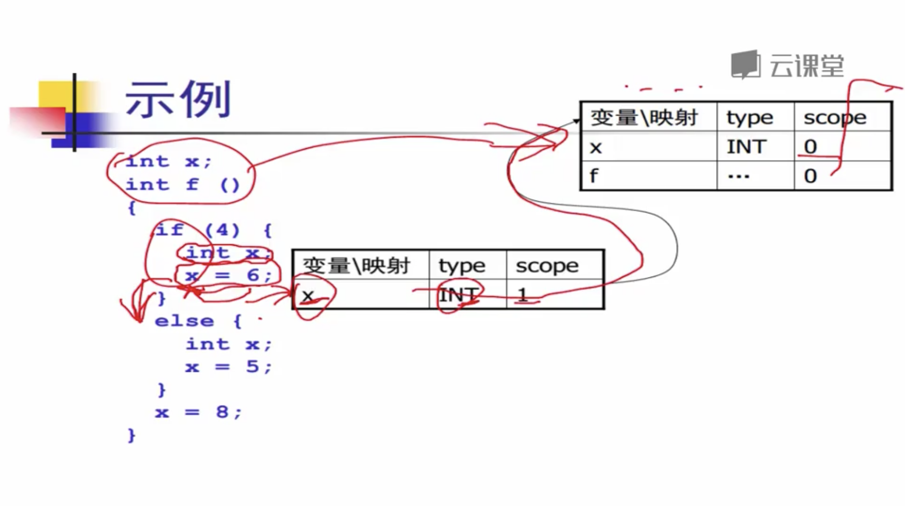
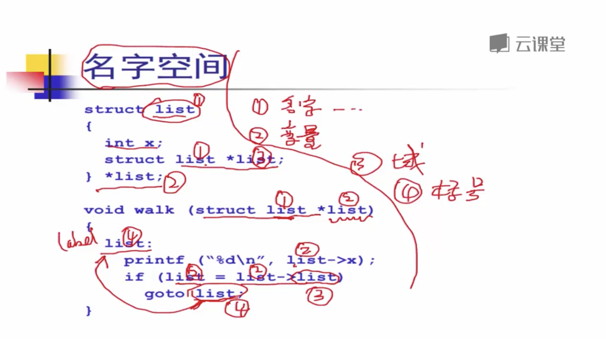
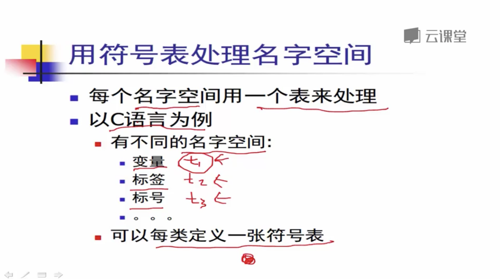

# 符号表

## 符号表

**`符号表`是在`语义检查`和`语义分析`当中的一个`非常核心`的一个`数据结构.`**

### 

### 符号表的接口

### 符号表的数据结构

### 符号表的高效实现

### 作用域

### 符号表处理作用域的方法

* **方法1 :   一张表的方法**
  * **`进入`**作用域时, **`插入元素 (新元素在头部插入,方便删除)`**
  * **`退出`**作用域时, **`删除元素`**
* **方法2:  采用符号表构成的 `栈`**
  * **`进入`**作用域时,  **`插入新的符号表`**
  * **`退出`**作用域时,  **`删除栈顶符号表`**

### 

### 名字空间

