# 语法分析

## 语法分析

### 语法分析的主要任务

**语法分析的主要任务的是从 `词法分析器` 输入过来的`记号流`  , 然后 `分析语法是否有错误 (如果有错误,则要给出如何修改为正确的提示),` 随后通过`某种语言的语法规则`输出为`抽象语法树 .`**

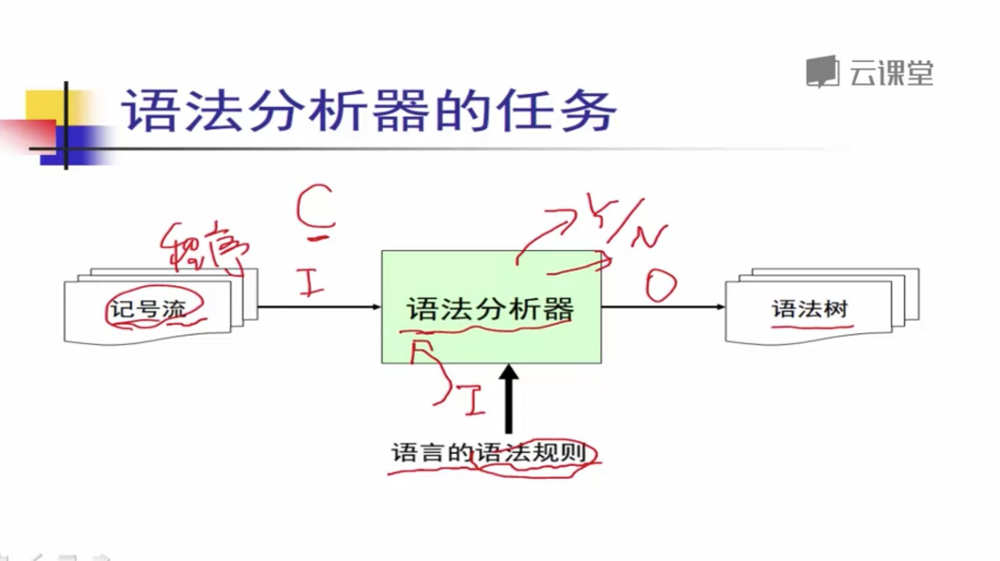

### 

### 语法错误处理

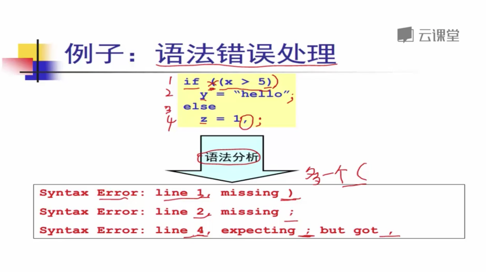

### 语法树构建

**当语法错误处理完成后,无错误的情况下 会进行语法树的构建.**

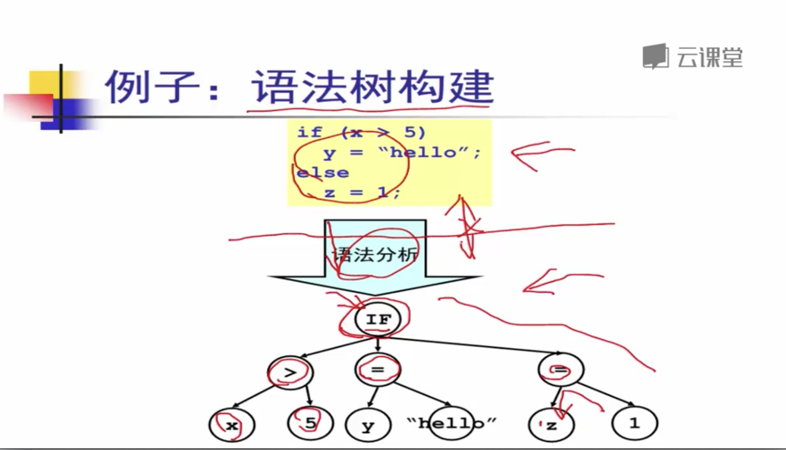

### \*\*\*\*

### **路线图**

* **数学理论 :  上下文无关文法\( CFG \)**
  * 描述语言 语法规则 的数学工具
* **自顶向下分析算法**
  * 递归下降分析算法 \( 也称 分析算法\)
  * LL分析算法
* **自顶向上分析算法**
  * LR 分析算法

### 

### 上下文无关文法

**上下文无关文法 是描述`程序语言语法`的 一个强有力的`数据学工具`** 

**四元组都包含**  $$G = ( N, T, P, S)$$  **.**

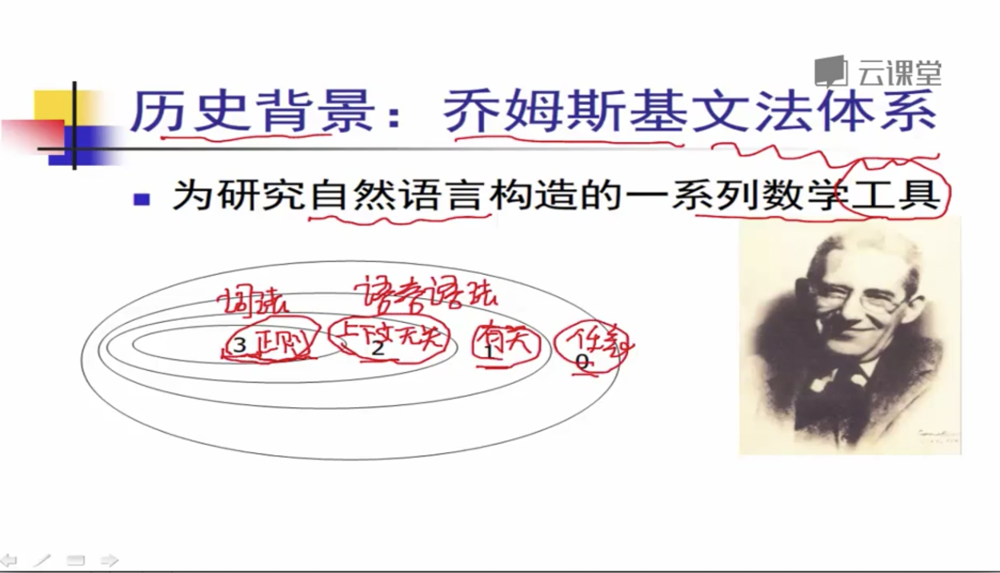

#### 意义作用和文法结构

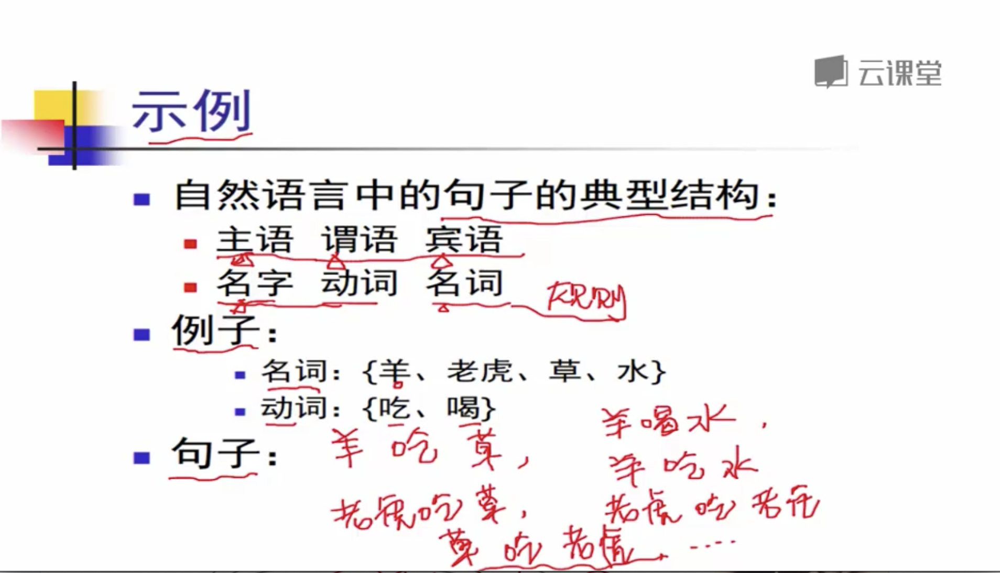

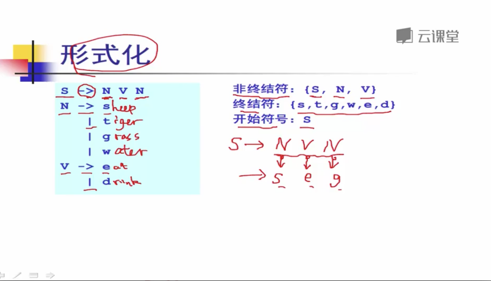

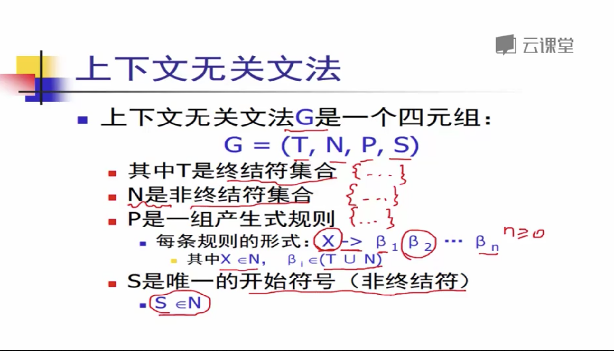

**`终结符小写,  非终结符大写, 开始符号也是大写 可以看成是第一个非终结符.`**

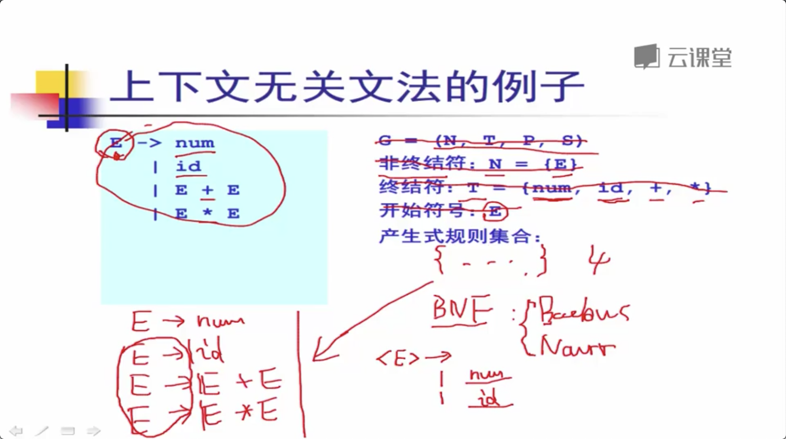

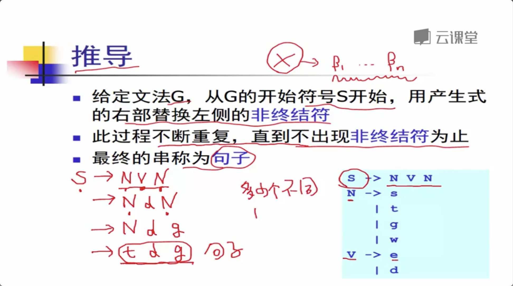

#### 最左推导和最右推导

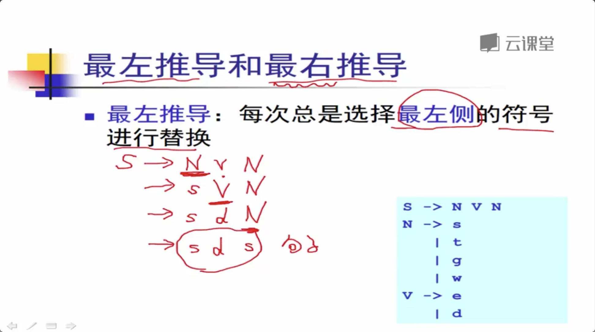

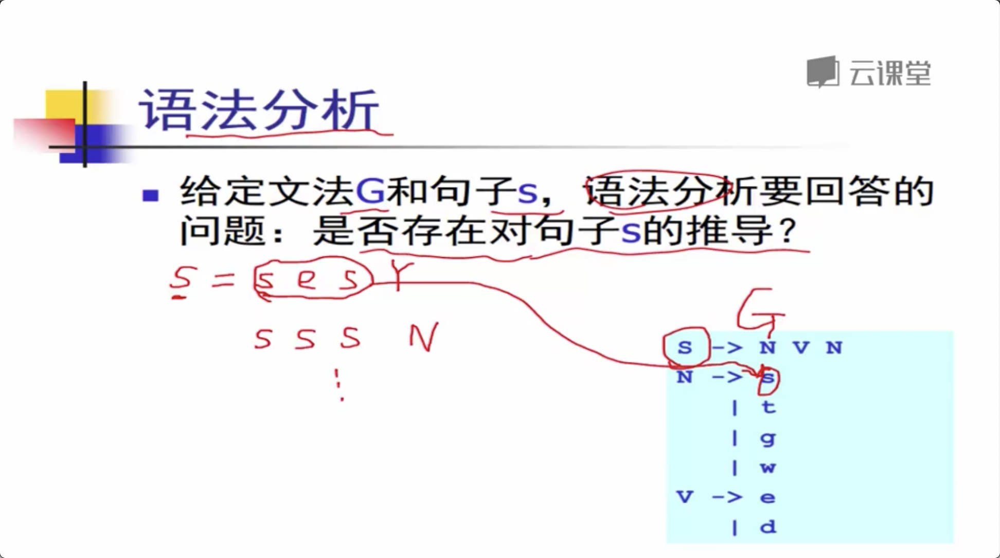

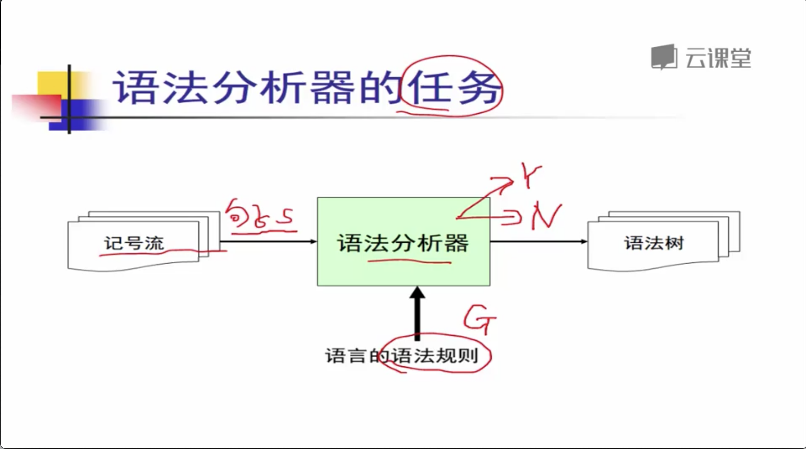

### 

### 分析树 与 二义性

#### 推导与分析树

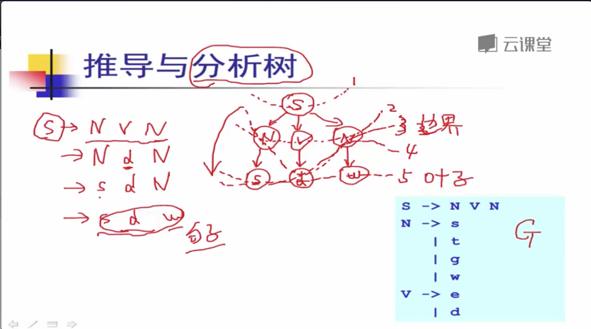

#### 分析树

#### 分析树 一般是后续遍历,   左右中.

* 推导可以表达成树状结构
  * 和推导所用的顺序无关 \(最左, 最右, 其他\).
* 特点
  * 树中的每个**`内部节点`** 代表**`非终结符`**
  * 每个**`叶子结点`**代表**`终结符`**
  * 每一步推导代表从**`双亲节点`**生成它的直接**`孩子节点`**

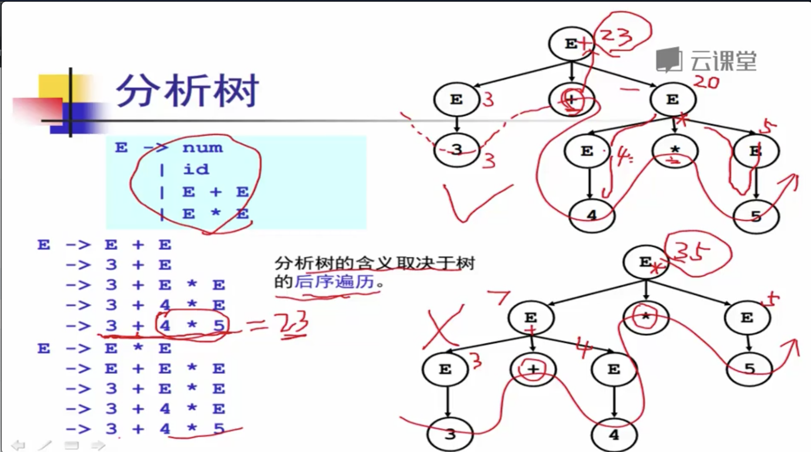

#### 二义性文法

**在编译器中, 不应该出现二义性文法**

* 给定文法 **`G`**, 如果存在句子 **`s`** , 他油两棵不同的分析树, 那么称 G 是**`二义性文法`**
* **从编译器角度,  二义性文法存在问题**
  * 同一个程序会有不同的含义
  * 因此程序运行的结果不是唯一的
* 解决方法:  **`表达式文法的重写`**

#### 表达式文法的重写

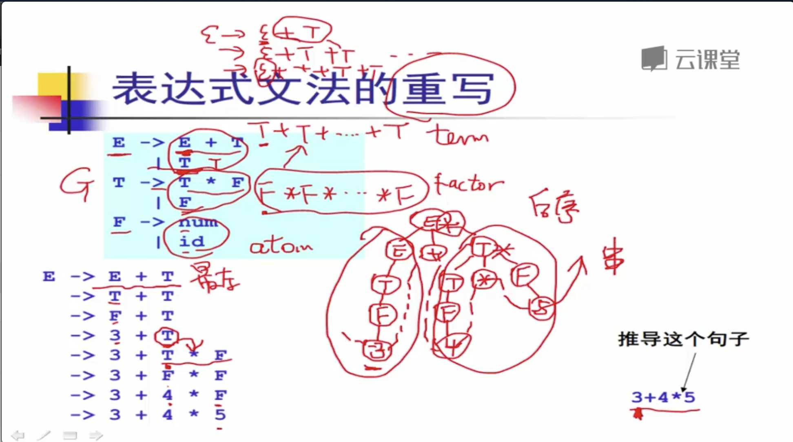

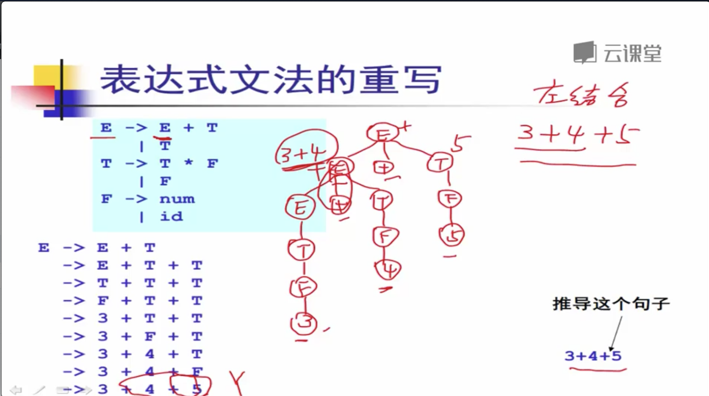

## 语法分析算法

### 自顶向下分析算法

**推导的过程中,往往需要`回溯`来帮助推导**

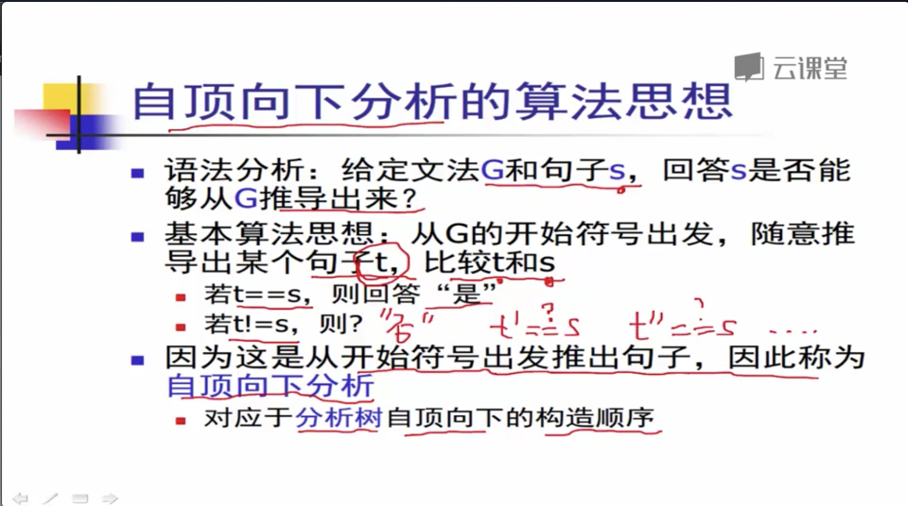

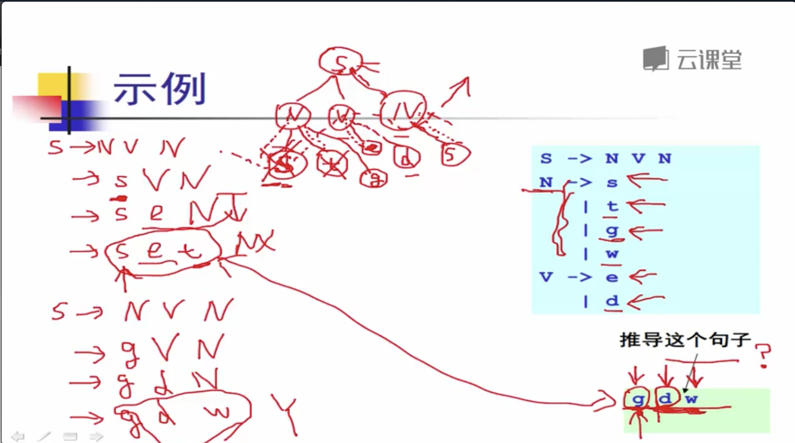

\*\*\*\*

