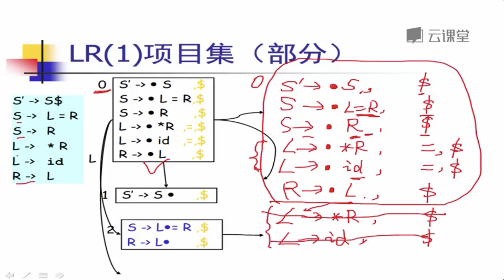

# 语法分析

## 语法分析

### 语法分析的主要任务

**语法分析的主要任务的是从 `词法分析器` 输入过来的`记号流`  , 然后 `分析语法是否有错误 (如果有错误,则要给出如何修改为正确的提示),` 随后通过`某种语言的语法规则`输出为`抽象语法树 .`**

### 

### 语法错误处理

### 语法树构建

**当语法错误处理完成后,无错误的情况下 会进行语法树的构建.**

### \*\*\*\*

### **路线图**

* **数学理论 :  上下文无关文法\( CFG \)**
  * 描述语言 语法规则 的数学工具
* **自顶向下分析算法**
  * 递归下降分析算法 \( 也称 分析算法\)
  * LL分析算法
* **自顶向上分析算法**
  * LR 分析算法

### 

### 上下文无关文法

**上下文无关文法 是描述`程序语言语法`的 一个强有力的`数据学工具`** 

**四元组都包含**  $$G = ( N, T, P, S)$$  **.**

#### 意义作用和文法结构

**`终结符小写,  非终结符大写, 开始符号也是大写 可以看成是第一个非终结符.`**

#### 最左推导和最右推导

### 

### 分析树 与 二义性

#### 推导与分析树

#### 分析树

#### 分析树 一般是后续遍历,   左右中.

* 推导可以表达成树状结构
  * 和推导所用的顺序无关 \(最左, 最右, 其他\).
* 特点
  * 树中的每个**`内部节点`** 代表**`非终结符`**
  * 每个**`叶子结点`**代表**`终结符`**
  * 每一步推导代表从**`双亲节点`**生成它的直接**`孩子节点`**

#### 二义性文法

**在编译器中, 不应该出现二义性文法**

* 给定文法 **`G`**, 如果存在句子 **`s`** , 他油两棵不同的分析树, 那么称 G 是**`二义性文法`**
* **从编译器角度,  二义性文法存在问题**
  * 同一个程序会有不同的含义
  * 因此程序运行的结果不是唯一的
* 解决方法:  **`表达式文法的重写`**

#### 表达式文法的重写

## 语法分析算法

### 自顶向下分析算法

**推导的过程中,往往需要`回溯`来帮助推导**

### 算法实现 \(伪代码描述\)

#### 算法的讨论

* **算法需要用到回溯**
  * `给分析效率带来问题, 效率不够理想`
* 而就这部分而言 \( 就所有部分 \) , 编译器必须要**`高效`**来执行编译
  * _比如编译成千上万行的内核代码, 就要求高效率来执行编译_
* **因此, 实际上我们需要 `线性时间` 的算法来避免如下低效率内容**
  * **避免回溯**
  * 引出 **`递归下降分析算法`** 和  **`LL(1)  分析算法`**

#### 修改之后的算法思路,  它避免了频繁的回溯

### 递归下降分析算法

* 也称为 **`预测分析`**
  * **`分析高效  (线性时间)`**
  * **`容易实现 (方便手工编码)`**
  * **`错误定位和诊断信息准确`**
  * **`被很多开源和商业的编译器所采用`**
    * **`GCC 4.0 ,   LLVM (苹果的c, c++, object c 编译器) ,.....`**
* **算法基本思想**
  * **每个非终结符构造一个分析函数**
  * **用`前看符号`知道产生式规则的选择**

### 

### LL\(1\)  分析算法

#### 简化的分析和实现

#### LL\(1\) 分析表的冲突

####  一般条件下的 LL\(1\) 分析表构造算法

#### NULLABLE集合计算

#### FIRST集合计公式

#### FOLLOW 集的不动点算法

#### 计算FIRST\_S 集合

### 语法分析  驱动代码

### LL\(1\) 分析处理冲突处理

### \*\*\*\*

### **自底向上分析算法**

* **研究其中最重要爷是最广泛应用的一类**
  * **LR 分析算法 \(移进 - 归约算法\)**
    * **算法运行高效**
    * **有现成的工具可用**
  * **这也是目前采用广泛的一列语法分析器的自动生成器中采用的算法**
    * **YACC, bison, CUP , C\# yacc, 等等**

### **点记号**

### LR\(0\) 分析算法

### LR\(0\) 算法思想

### 

### SLR 分析算法

**是根据LR\(0\) 算法的一个改进**

### 

### LR\(1\) 分析算法

**根据LR\(0\) 算法改进的另一个算法, 这个算法避免了 `SLR分析表` 中的冲突情况.**

**LR\(1\) 和 LR\(0\) 的区别就是 `闭包` 算法不同.**

## LR\(1\) 分析工具

