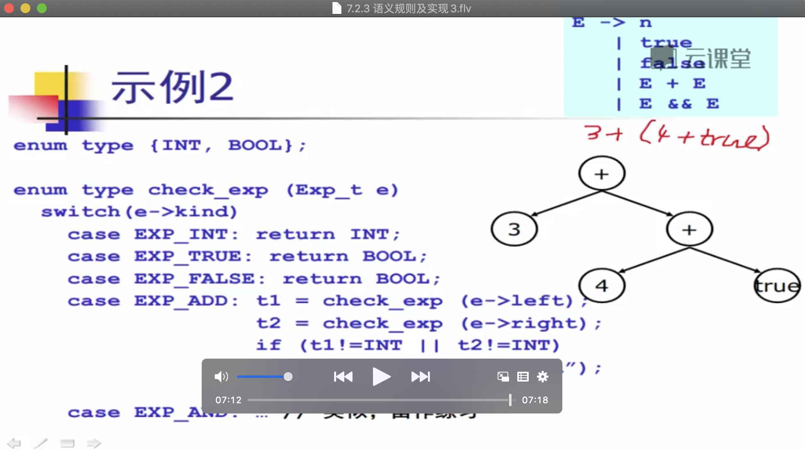

# 语义分析

## 语义分析

**`语义分析器`它依赖于 `语法分析器` 生成出来的 `抽象语法树` 来当作输入, 然后输出`中间表示 给后端.`**

### 语义分析的任务

* **语义分析也称为 `类型检查` , `上下文相关分析`.**
* **负责检查程序 `(抽象语法树)`  的 `上下文相关`  的属性:**
  * **这是具体语言相关的, 典型的情况包括:**
    * 变量在使用前 先进行声明
    * 每个表达式都有合适的类型
    * 函数调用和函数的定义一致
    * ..... \(等等\)

### 

### 语义分析器概念上的结构

### 程序语言的语义

## 语义检查

### 类型检查算法

### 

### 变量声明的处理

### 类型检查算法

### 语句的处理

## 其他问题

* 语义分析中要考虑的其他问题:
  * **类型相容性? \(或者相等\)**
  * **错误诊断?**
  * **代码翻译?**

### 类型相等

### 

### 错误诊断

### 代码翻译

