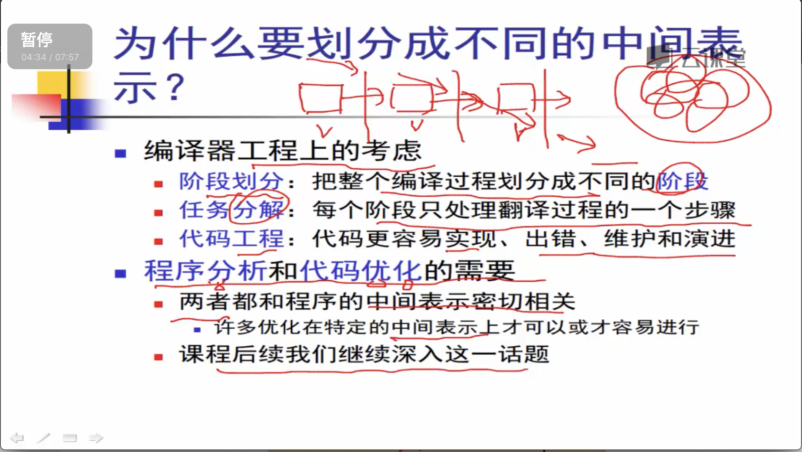

# 中间表示

## 中间表示

### 路线图

### 为什么要划分成不同的中间表示

### 

### 中间代码

**三地址码: add    x , y , z              将 `地址y的值`  和 `地址z的值`  进行 加法\(add\)运算,  将`结果放入地址x 中`**

### 

## 三地址码

### 使用三地址码的编译器结构

### 三地址码的基本思想

### 简单的一种控制结构示例

### 

### 三地址码的定义

### 三地址码的数据结构

### 生成三地址码

